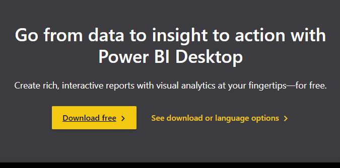
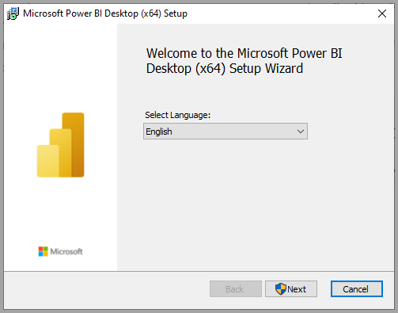
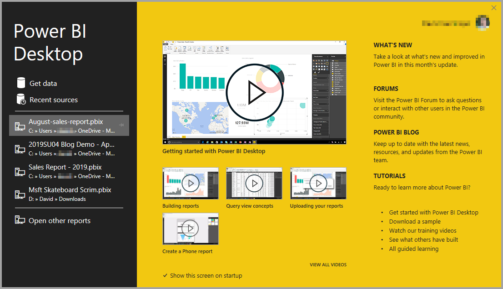
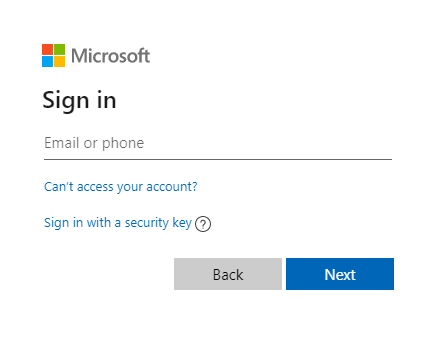
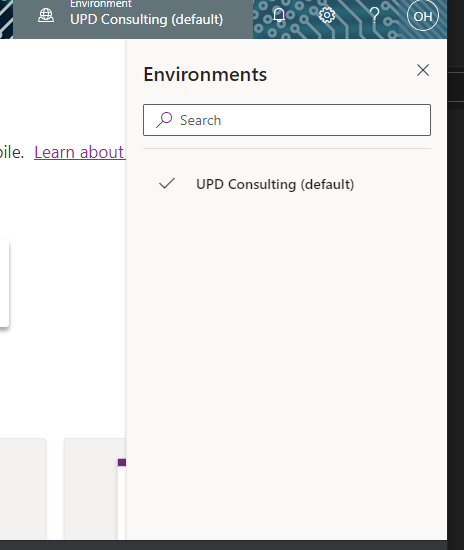

Pre-Requisites
==============

This file details the installation of the prerequisites needed for the PPT
Interventions Dashboard

Permissions & Licensing
-----------

-   Active Directory Administration
-   Workspace administrator for PowerBI
-   Workspace administrator for Power Apps
-   Dataverse administrator permissions
-   SQL Server
-   Installation of the Glendale data set (for testing)
-   PowerApps subscription with Dataverse add-on
-   MS Office 365 subscription
-   PowerBI Desktop
-   PowerBI Pro or Premium subscription
-   On-premises data gateway (for local environment testing)

Install the On-premises data gateway
------------------------------------

A data gateway is needed for having local access to an SQL Database is needed,
it can be downloaded from
[here](https://docs.microsoft.com/en-us/data-integration/gateway/service-gateway-install)

Install SQL Server
------------------

-   Go to the Microsoft Download Center and download from
    [here](https://www.microsoft.com/en-us/download/details.aspx?id=101064).

-   Run the installer.

-   Download and run the installer for [Microsoft SQL Server Management
    Studio](https://aka.ms/ssmsfullsetup)

Install the Glendale data set (optional, needed for testing in case there is no ODS available)
----------------------------------------------------------------------------------------------

-   Download Glendale data set from
    [here](https://odsassets.blob.core.windows.net/public/Glendale/EdFi_Glendale_v32-20190610.7z)

-   Expand the .7z file with WinZip or another similar tool.

-   Check it is a bak file.

-   Restore .bak file in MS Server Management Studio

-   Right click Databases

-   Restore Database

-   In Source: Device look for the file in the “…” menu

-   Click OK

-   Verify your restore:

    -   Connect to Glendale database

    -   Create a new query `“SELECT COUNT(*) FROM edfi.Student”`

Result should be close to 50,000 (47,624)

PowerBI Installation
--------------------

-   Get PowerBI Desktop from
    [here](https://powerbi.microsoft.com/en-us/desktop/)

-   Install Power BI Desktop after downloading it

You're prompted to run the installation file after you've finished downloading
it. Beginning with the July 2019 release, Power BI Desktop ships as a single
.exe installation package that contains all supported languages, with a separate
.exe file for the 32-bit and 64-bit versions.

 

-   Using Power BI Desktop

-   When you launch Power BI Desktop, a welcome screen is displayed.

 

If you're using Power BI Desktop for the first time (that is, the installation
isn't an upgrade), you're prompted to fill out a form or sign in to the Power BI
service before you can continue.

 

#### PowerBI Desktop Installation Requirements

 

-   Windows 7 / Windows Server 2008 R2, or later

-   .NET 4.6.2

-   Internet Explorer 10 or later

-   Memory (RAM): At least 1 GB available, 1.5 GB or more recommended.

-   Display: At least 1440x900 or 1600x900 (16:9) required. Lower resolutions
    such as 1024x768 or 1280x800 aren't supported, as certain controls (such as
    closing the startup screen) display beyond those resolutions.

-   Windows display settings: If you set your display settings to change the
    size of text, apps, and other items to more than 100%, you may not be able
    to see certain dialogs that you must interact with to continue using Power
    BI Desktop. If you encounter this issue, check your display settings in
    Windows by going to Settings \> System \> Display, and use the slider to
    return display settings to 100%.

-   CPU: 1 gigahertz (GHz) 64-bit (x64) processor recommended.

PowerApps Installation
----------------------

-   Go to [PowerApps.com](http://create.powerapps.com/)

-   Access with your organization account

-   Choose an environment by clicking on the Environments button in the header
    bar

