PPT Interventions Dashboard User manual
=======================================

 

Table of contents
-----------------

Access the dashboard

Description of the interface

Filtering students

New referrals

Editing referrals

Closing a referral

Analysis

 

### Access the Dashboard

--------------------

To access the dashboard:

-   Go to PowerBI.com

-   Sign in with your credentials

-   In the landing page go to shared with me

-   Click the name of the report PPT Interventions

Description of the interface
----------------------------

The interface consists of the following Pages:

-   Landing page

-   Student profile

-   Attendance

-   Assessment

-   Course Assessment

-   Assessment - All Students

 

### Landing page

The landing page has filters and counts for:

-   Type of referral

-   Date of Referral

-   Referral Party

-   Grade

-   School

-   Student name

-   Case length (number of days)

-   Case status (Active or new Referrals)

 

At the center is an app where information about cases can be entered and
explored.

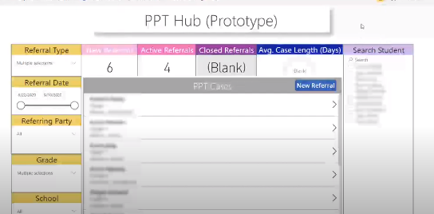

Filtering students
------------------

Students can be filtered in the Landing page with any of the of the filters:

-   By referral type

-   By referral date

-   By referring party

-   By Grade

-   By school

-   By student name

 

New referrals
-------------

To add a New referral:

1.  Clear all filters you have applied

2.  Go to the application and click New Referral

3.  Search student by name

4.  Choose either to add an intervention or review interventions

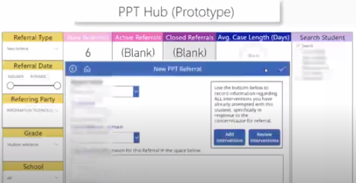

### Add intevention

1.  Click the button to add intervention

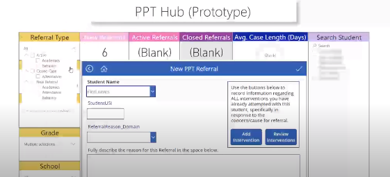

1.  Choose the student

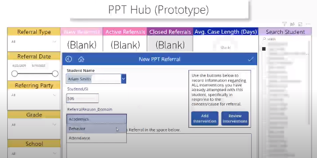

1.  Choose the intervention reason

1.  Fill the intervention data:

    -   Type of intervention

    -   Response to intervention

    -   Intervention start and end dates

    -   Frequency of intervention

2.  Click the check mark to submit

Review Interventions
--------------------

After creation we can click on the review interventions button of the app to

review existing interventions, new interventions won’t update until the whole

dashboard updates and that is configured by the administrator.

 

1.  Use the filters to show only the referrals you need

2.  This will show the referrals selected in the application

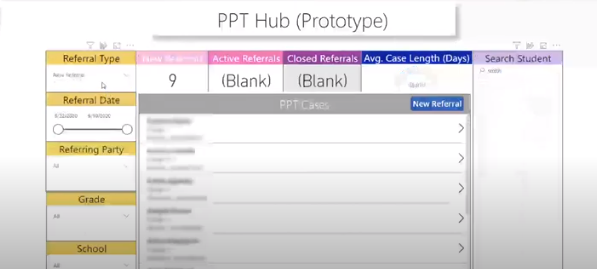

1.  Referrals can be inspected by clicking the chevron (\>) to the right of the
    list

 

Editing referrals
-----------------

After clicking on the chevron (\>) referrals can be edited with notes

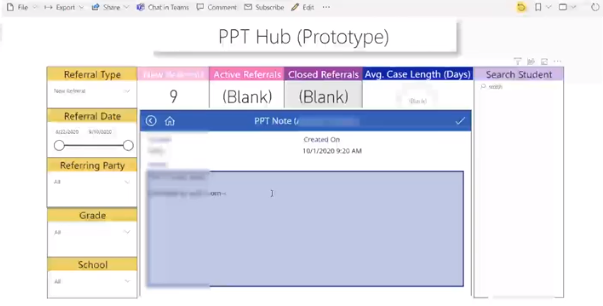

 

Closing a referral
------------------

To close a referral, we need to click on the Close this case button

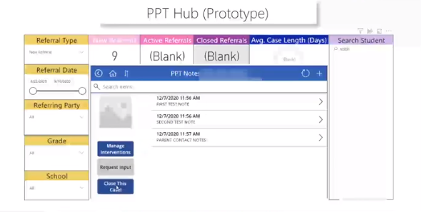

Select the option to close the case or reactivate it (in case it was already
closed).

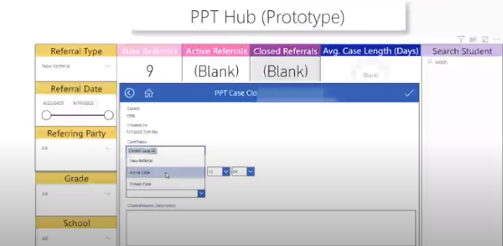

Choose the closing reason

 

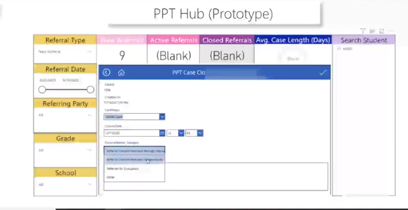

And fill the reasons for closing the case in the text field

 

Analysis
--------

For Analysis we have the dashboard pages for:

-   Student profile

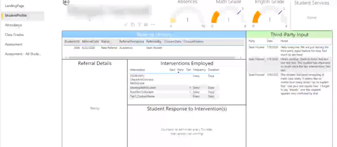

The Student profile page gives us a drill-down and history of all interventions
attempted with a student as well as summary information about absences and
grades. It allows us to filter by the intervention type and responsible party.

-   Attendance

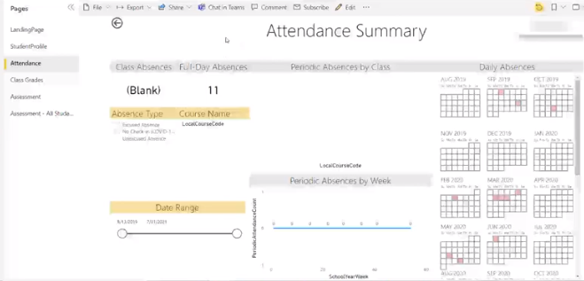

The attendance dashboard page shows a summary of attendance by class, by day, by
date range or a summary by month. The left hand-side of the page works as a
filter by course and by absence type, Excused, unexcused, etc. The right hand
side shows a calendar view which allows quick visual inspection.

 

-   Assessment

The assessment page allows a quick overview and filtering of the different
assessments administered to a student

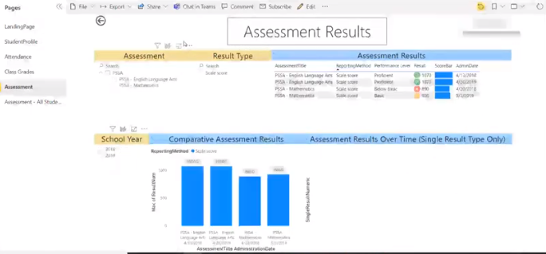

It allows filtering by the type of assessment, by the result type and by school
year, and shows the assessment results, the comparative results and the results
over time, for certain types of tests once the Result Type filter is applied.

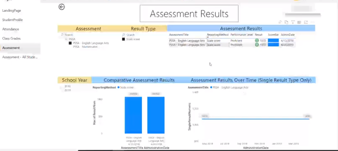

-   Class grades

The course assessment interface  allows for filtering assessments by date, by
term, by period, by teacher,

course grades with the different filters allow for a more detailed drill down.

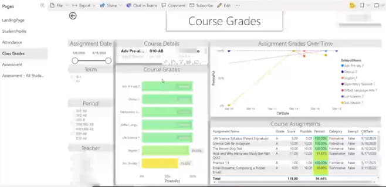

The chart shows a progression of grades over time with a simple regression
model.

-   Assessment-All students

This allows for the comparison of a student against all other students that took
that assessment.

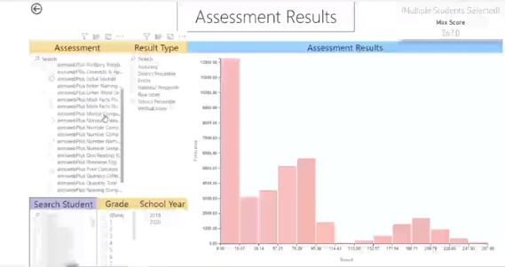

This page can be filtered by student, by assessment, by result type, by grade
and schoolyear.

When filtering the assessment and result type, we can search for a specific
student and his Max Score will be shown in the top right corner of the
dashboard, then we can compare where he is compared with the rest of the
selection in the histogram.

